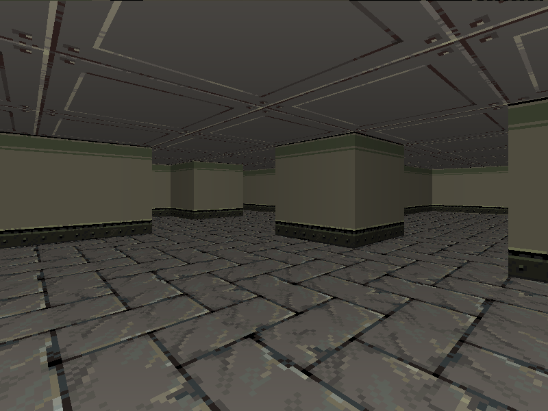

# Raycasting engine

Old-school raycasting pseudo-3D game engine made with C++. Just a project to
help me get better at trigonometry math and low level coding.



## Features

- [x] Perspectively correct raycasting engine.
- [x] Collision detection.
- [x] Textured floor and wall.
- [x] Diffuse shading.
- [x] Y-shearing. (vertical camera movement)
- [ ] High resolution and performance.
- [ ] Optimized for fast and small WebAssembly.

## Performance (FPS)

With many added features the engine's performance is currently very poor, especially the WASM version. I'll do some profiling and optimization before continuing adding more stuffs.

## Requirements

- A C++ compiler that supports C++17.
- GNU make.
- Python 3. (with virtual environment)
- For native backend: [SDL2](https://www.libsdl.org/download-2.0.php).
- For WASM backend: Clang, LLVM and LLD (the only C++ compiler toolchain that
  supports WASM other than Emscripten that I know of)

The default compiler is `clang++` so you need to edit the [makefile](makefile)
if you want to use another compiler.

Check if the requirements are properly installed 

```bash
clang++ --version
make --version
python --version
sdl2-config --version
wasm-ld --version
```

Building on Windows should work in theory but I can't test that.

## Building

Run `make build` for the native version and `make web` for the wasm module.

It should automatically create the virtual environment and install pip
dependencies during the first compilation. Subsequent builds are faster and
since they don't need to do all that again.

Run the copiled binary `build/raycaster` to use the native version or host the
website with

```
python -m http.server 8080 -d web
```

And go to `localhost:8080` in your browser to use the web version.

## Todo

- Tilemap system for easier wall texturing.
- Use integer to store rotation (`[0..2^32 - 1]` instead of `[0..2π)`).
- Use lookup tables to calculate trigonometry and their inverse.
- Multi-threading: `std::async` on native version and multiple web workers on
  WebAssembly version.
- Sprites with 1D depth buffer.
- Use a more cache efficient way to manipulate the screen buffer.
- Build a game.

## License

This project is licensed under the [AGPL-v3 License](LICENSE).
